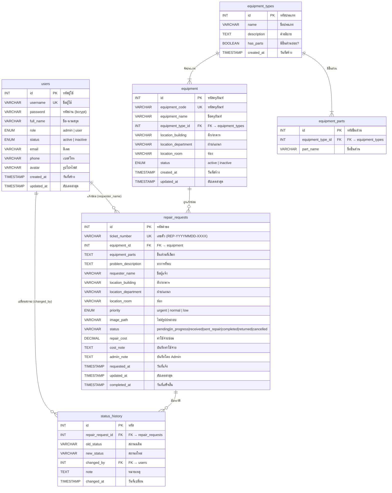

# 📊 ER Diagram - ระบบแจ้งซ่อมครุภัณฑ์ (Database: repair_system)



---

## 🔗 ความสัมพันธ์ระหว่างตาราง (Relationships)

| Parent (ต้นทาง) | Child (ปลายทาง) | Cardinality | FK Column | Description |
|:---|:---|:---|:---|:---|
| `equipment_types` | `equipment` | 1 : N | `equipment_type_id` | ครุภัณฑ์แต่ละชิ้นมีประเภทเดียว |
| `equipment_types` | `equipment_parts` | 1 : N | `equipment_type_id` | แต่ละประเภทมีได้หลายชิ้นส่วน |
| `equipment` | `repair_requests` | 1 : N | `equipment_id` | ครุภัณฑ์หนึ่งชิ้นถูกแจ้งซ่อมได้หลายครั้ง |
| `users` | `repair_requests` | 1 : N | `requester_name` | ผู้ใช้แจ้งซ่อมได้หลายครั้ง (link by name) |
| `users` | `status_history` | 1 : N | `changed_by` | Admin เปลี่ยนสถานะได้หลายครั้ง |
| `repair_requests` | `status_history` | 1 : N | `repair_request_id` | แต่ละคำขอมีประวัติการเปลี่ยนสถานะ |

---

## 📊 สถานะคำแจ้งซ่อม (Status Flow)

```mermaid
stateDiagram-v2
    [*] --> pending : สร้างคำแจ้งซ่อมใหม่
    pending --> in_progress : Admin รับเรื่อง
    in_progress --> received : รับงานเข้าซ่อม
    received --> sent_repair : ส่งซ่อมภายนอก
    sent_repair --> completed : ซ่อมเสร็จ
    completed --> returned : คืนครุภัณฑ์
    pending --> cancelled : ยกเลิก
    in_progress --> cancelled : ยกเลิก
    received --> cancelled : ยกเลิก
    sent_repair --> cancelled : ยกเลิก
    returned --> [*]
    cancelled --> [*]

    note right of pending : User สร้างคำแจ้ง
    note right of completed : Admin บันทึกค่าใช้จ่าย